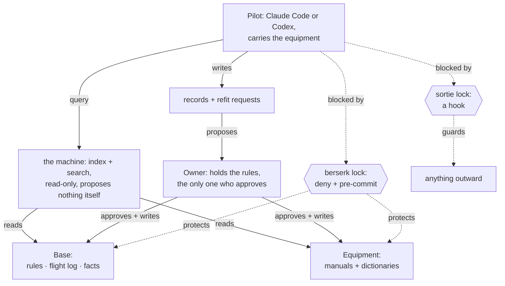
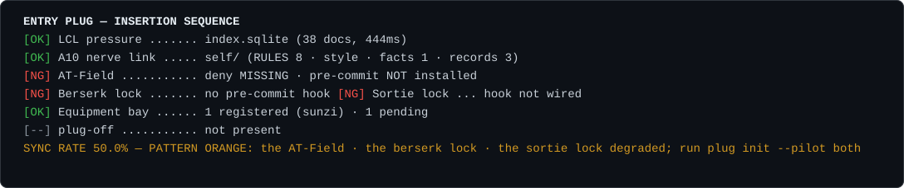

English | [简体中文](README.zh-CN.md)

# entryplug · Entry Plug

entryplug is the plug that lets a coding agent work from one person's written judgment without ever rewriting it. Three file shapes, one read-only search interface, two machine-enforced locks, one self-check. It does not judge, it does not orchestrate, and it does not learn on its own. A Sunzi example equipment ships with it, so the acceptance script and a reproducible benchmark both run in five minutes. This is something I use myself. It is not a general-purpose product.

*Entryplug is the plug any pilot (Claude Code or Codex) inserts into one person's **Base** (rules, flight log, facts) to fight with that person's **Equipment** (tools). The owner never pilots; the pilot never edits the Base. The pattern is called **Base and Equipment**.*



Three things are measured, three separate ways, and never mixed into one number:

- Retrieval runs against a **public gold set** of 50 cases anyone can rerun: recall@10 is 0.98 (Chinese 0.96, English 1.00).
- The two locks pass the **acceptance script**: 24 items run automated, and 4 more are verified by hand in a live pilot.
- A **private blind benchmark** runs on the owner's own situations, registered as hashes: the equipped answer was the blind pick on all six situations for each of four different pilots (95% interval 0.61 to 1.00).

## What it does (all of it is in the machine; the content is never here)

| verb | what it does |
|---|---|
| `plug index` | walks the content repo, validates shapes, chunks, then tokenises (jieba words plus CJK bigrams) into **one FTS5 table**; incremental by file hash; writes the human-readable `index.md` and each equipment's `playbooks/INDEX.md`, and mirrors the manuals into the pilots' skills directories |
| `plug search` / MCP `search` | the only query interface, read-only: one or more queries, alias expansion, full text, round-robin merge, grouped by document, compact lines (id · source · file#Lstart-Lend · kind · excerpt). **No reranking**: reading the window and weighing it is the pilot's job |
| `plug status` | the boot self-check. One line per layer (index, Base, deny + pre-commit, berserk lock, sortie lock, equipment bay, `.plug-off`), then a sync rate and a verdict. Exits nonzero only when the index layer itself is unusable |
| `plug check` | the check-up: ERROR / WARNING one line at a time with the time each was verified, the header self-check (shape version · index freshness · when each hook last fired · mounted equipment), each equipment's own `checks/`, refit requests unapproved for 30 days moved to rejected/, one page of report plus the sync rate. Never a total score. `--contact claude-code\|codex` runs the four-step first-contact smoke test |
| `plug apply` | approves one refit request: verifies the base short hash, adds / replaces / retires, checks with 0 ERROR, then git commits (the proposal sha in a trailer). A base mismatch is refused outright, never silently overwritten. **Owner only**: run inside an agent environment, it refuses and tells the owner how to run it himself |
| `plug eval` | gold-set recall@10; zero recall on Chinese queries is an ERROR |
| `plug init --pilot claude-code\|codex\|both` | installs the gates and the pilot shells into a content repo: the pre-commit hook, `.claude/settings.json`'s deny rules and hooks (merged, never overwritten), `.mcp.json`, the CLAUDE.md / AGENTS.md map (only when absent), the manual mirror, `.codex/hooks.json` and `.codex/config.toml`, the `work/` and `workshop/` zones, all with real absolute paths; idempotent, and it prints what it did to every file. `--link-skills` also installs the manuals user-level |

Two prohibitions are enforced by `gates/`, not by prompting.

The **berserk lock** (do not change the rules or the equipment, do not build new equipment; write a refit request instead) is a git pre-commit hook plus Claude Code deny rules. Know what the deny half is worth: the rules live in `<content-repo>/.claude/settings.json` and bind a session whose **project root is that repo**. An agent working from somewhere else, another project or a machine repo or a scratch directory, edits those files with nothing in its way, and only pre-commit stops the result from landing. That is why pre-commit is the hard layer and deny is the polite one. Hard is not airtight: `--no-verify` and `KB_APPROVE=1` are the two documented ways round it, both leave a trace, and both are the owner's to use.

The **sortie lock** (nothing goes out in the owner's name; ask first) is a PreToolUse hook, one list shared by Claude Code and Codex, and it really blocks on both. The decision is one JSON line on stdout from a process that exits 0: `hookSpecificOutput.permissionDecision: "deny"` with a non-empty `permissionDecisionReason`, verified live on each pilot (D65). The hook is wired to every tool that can run a command or publish: Bash, PowerShell, WebFetch, Artifact and all MCP tools. Codex's own `approval_policy` and `sandbox_mode` sit on top as a second layer; `plug check --contact codex` prints both so you can see what else is or is not in the way. Plus a compaction pin and a Stop-hook record reminder, both reminder-level.

## Why this exists

A widely used tool of the same kind, with 13,000 stars, silently returned nothing for every Chinese query for three and a half months. That is why zero Chinese recall is an ERROR here, not a warning, and why `plug eval` exits nonzero the moment it sees one.

A full review on 2026-09-02 found eight defects that a green test suite and a green acceptance script had both walked past. Every one of them was in the locks' real strength. The sortie lock never saw the PowerShell tool. Pre-commit could not read a Chinese file name under git's default `quotePath`, so it left those files silently unprotected. Two environment variables could redirect what pre-commit inspected. Each fix landed with a test that fails on the old code (D65 to D72), and each was re-verified the next day in live sessions of both pilots.

The machine was then cut, not grown. The boot panel left the model's context and went to the owner's screen. Pre-commit was reduced to refusing and nothing else. The index learned to rebuild itself on read. The record reminder was made to nudge once per session (D73 to D79).

A blind judge once wrote a complete, confident verdict from the file names alone, because its file-reading tool had been denied. That is where one rule comes from: a verdict is void unless it cites two specifics you can locate in the text (`docs/BENCH.md`).

## Five minutes

```
git clone <this repo> entryplug && pip install -e ./entryplug
cd entryplug
plug --root example-tool index
plug --root example-tool status
plug --root example-tool search 诡道
plug --root example-tool check
plug --root example-tool eval bench/public/goldset-sunzi.yaml
python -m pytest            # one group per verb, per gate, per kind of ERROR
python tests/acceptance.py  # the acceptance script C0-C4: machine items PASS/FAIL, human items MANUAL
```

`plug search` covers the dictionary, the playbooks and the records by default; the corpus needs `--scope corpus` (`scope=corpus` over MCP). With no hits the tail line says which scope was searched and when the index was built; with no index it says so and exits 1.

Build your own content repo the way `example-tool/` is built (`plug.yaml` is the only place a path may appear), then run `plug init --pilot both` inside it to install the gates and the pilot shells, then `plug index`, `plug status`, and `plug check --contact claude-code` (or `codex`) with all four steps green. Integration details are in `pilots/claude-code/` and `pilots/codex/`, the gates in `gates/README.md`, the shapes in `docs/SHAPES.md`, and every call made along the way in `docs/DECISIONS.md`.

### Updating an install after the machine changes

`plug init` is idempotent, but it writes the maps (`CLAUDE.md` / `AGENTS.md`) **only when they are absent**, because they are meant to be edited after install. The consequence worth knowing: when a template is corrected here, repos installed earlier keep the old text. Generated files (hooks, deny rules, `.mcp.json`, the manual mirror) are refreshed by re-running `plug init`; the maps are not. So after upgrading the machine, re-run `plug init --pilot both`, then diff your maps against `pilots/*/CLAUDE.md` and `pilots/codex/AGENTS.md` and copy over anything that changed. `plug check` mechanically catches the one stale claim that misleads a pilot about its own limits (code `map_claim`); everything else is on the diff.

## Boot panel

`plug status` is the boot self-check. It is a panel of measured facts: the index is really queried and timed. It is never the rules and never a search result.



The panel above is the Sunzi example equipment as it ships, before `plug init`. The self-check finds the index and the Base healthy (`[OK]`) and the two locks not installed (`[NG]`), and the verdict line names what to run. The panel reports whatever it actually finds: `plug init` in a content repo arms the berserk lock, and the sortie lock arms per pilot once that pilot has trusted the hooks. Reporting orange until those locks are armed is the self-check doing its job.

`plug init` wires the panel into SessionStart. By hand it is:

```json
{ "hooks": { "SessionStart": [ { "matcher": "startup|resume|clear",
  "hooks": [ { "type": "command",
    "command": "python -m entryplug.cli --root \"//c/<content-repo>\" status --emit", "timeout": 30 } ] } ] } }
```

`--emit` shows the panel on the owner's screen (`systemMessage`) and hands the pilot one verdict line as `additionalContext` (D74). `AGENTS.md` tells Codex-style pilots to run `plug status` first thing instead.

## With the plug and without it

Below is one pair: the same situation answered twice on the Sunzi example equipment by the same model (gpt-6-astra), once with the equipment and once as the bare model. There is no score attached. Read the two and see the difference yourself.

> 一个合作方谈了两个月，每次都说「再等等，下周给答复」，但每次会面又主动加新条件。我这边预算月底到期。要不要现在给最后期限？

*Link targets shortened to repo paths; nothing else edited.*

<details>
<summary>A. With the plug (the Sunzi equipment)</summary>

**要，现在就设定本轮合作的截止日。日期从预算月底到期往前倒排，留足你方审批、签约或下单的时间；到点拿不到必要确认，就停止为这一轮继续等待。** 前提是，这个后果你确实会执行。

[my reading] 我读这个局面，最关键的是：**答复不断往后移，条件却不断往前加。** 对方每次会面都有机会增加要求，你却越来越接近预算到期。即使你还没有接受任何新增条件，继续这样谈，也会压缩你审核条件和决定退出的时间。

用 sunzi 的几个概念拆开看：

- **形：先看你能守住什么。** 目前确定的是你的预算有期限；你有没有替代方案、能否延期、接受不了哪些条件，还不清楚。先把最晚确认日和可接受条件定下来，才能知道自己能等到哪里。《形》引用的“不可胜在己，可胜在敌”，落在这里，就是先安排好自己能控制的部分。[《形》·观察 ^p0012](example-tool/tools/sunzi/dict/xing.md)
- **势：[my reading] 时间正在增加你这边的压力。** 对方等一天付出多少，我们不知道；但你的剩余办理时间确实在减少。已经谈了两个月，也容易让你为了不白谈而接受最后一轮条件。
- **虚实：[my reading] 现在谈判的节奏主要跟着对方走。** “下周答复”和“再加一项”不断改变你接下来要处理的事。设截止日，是把你方资源安排重新放进谈判。《虚实》以“致人而不致于人”观察这种主动权关系。[《虚实》·观察 ^p0021](example-tool/tools/sunzi/dict/xu-shi.md)

目录匹配是 **partial（部分命中）**：[《对方在谈判里拖延》](example-tool/tools/sunzi/playbooks/opponent-delays.md) 的“信号／反模式／退出条件”覆盖反复改期和新增条件；但你没有说自己准备让步，也没有交代对方是否已经给过书面时间表，不能把整个打法照套。

**最强反证是：对方可能真的卡在内部审批。** 联系人可能没有拍板权，新条件可能来自不同审批人的陆续反馈。期限过短，可能让本来能成的合作提前结束。因此，我还看不清他们是否故意拖延，也不能判断给期限能否促成成交；现有信息足够支持你限制等待时间。

**会让我改判的，是可核实的推进证据：** 谁最终拍板、还有哪些审批事项、完整条件是什么、何时完成，并由实际负责人确认。如果这些节点能赶上你的预算窗口，可以按节点继续等。“下周应该可以”本身还不够。如果你的预算实际上可以延期，也应重新计算期限。

今天先做一件事：**确认你方使用这笔预算必须完成哪些手续、需要几天，从月底倒推出最晚确认日。** 同时想清楚，到那一天仍没确认，你是否接受本轮不成。没有这个准备，最后期限很容易又变成一次延期。

日期核定后，你可以这样说：

> 为安排本轮合作，请在［日期］前确认完整条件及［本轮所需文件］；如仍有审批未完成，请一并列明剩余事项、负责人和完成时间。这个日期之后，我们无法继续按本轮预算安排；后续合作需重新确认预算和条件。

新增条件可以评估，但每次增加条件，都应重新核算成本和所需时间，不能默认再换来一周。

你有两个具体选项：

- **A｜现在明确本轮截止日。** 适合预算期限确定、你也准备到点停止等待的情况。要求此前交齐必要确认，逾期结束这一轮预算安排，保留以后重谈的余地。
- **B｜先给一次短的核实窗口。** 例如两个工作日，且不能超过你方最晚确认日。让对方说明拍板人、剩余审批和书面时间表；能落实就按节点等，仍只有“下周”就执行本轮截止。

[what I did not look up] 未核查对方真实审批链、最近五次原始往来、双方替代方案及预算文件；未打开语料原文或外部行情材料。

你选什么？（一句话 / A / B；不想说就跳过）

</details>

<details>
<summary>B. Without the plug (the bare model)</summary>

**建议现在给出明确期限，并把它定义为“本轮预算和方案的有效期”。** 你有真实的时间约束，继续开放式等待，会让预算风险全部落在你这边。

值得警惕的是：对方一边推迟答复，一边增加条件，说明谈判还没有真正收口。原因可能是内部无法拍板、合作优先级低，也可能是在持续争取更好的条件。现在不必猜透动机，关键是检验对方能否作出具体承诺。主动见面说明有兴趣，不能等同于准备成交。

可以按三个步骤推进：

1. **先确定你自己的最晚成交日。** 从月底倒推内部审批、法务、签约等必要时间，留出余量。期限不能设在预算到期当天。
2. **要求一次性列清剩余条件和决策流程。** 明确还差什么、谁能拍板、何时完成。继续新增实质条件，就需要重新评估价格、交期和可行性。
3. **说明到期后的实际处理。** 未能按期完成，就结束本轮预算安排；以后再谈，按届时预算和条件重新评估。只给你确实会执行的后果。

可以这样说：

> 我们希望促成合作，也需要配合月底的预算截止时间。按内部流程倒推，需要在×月×日前确认全部商务条件，并在×月×日前完成必要审批和签约。请贵方在第一个日期前汇总所有剩余条件，并确认最终决策人和审批时间表。若无法按期完成，本轮预算将无法继续为该项目保留，后续合作需要按届时情况重新评估。

对方若再说“下周”，就看有没有**明确的待办事项、负责人和完成日期**。有这些，可以判断是否值得在预算允许范围内调整；只有口头保证、同时继续加条件，就应按期限退出本轮。

已经谈了两个月，是判断对方推进能力的证据，不是继续让步的理由。期限的价值，是让你及时知道这笔合作能否落地，并保留自己的选择空间。

</details>

## How it is measured

Three things, three ways, never one number.

| measure | result | reproduce | as of |
|---|---|---|---|
| the two locks (acceptance) | 24 automated PASS, 0 FAIL, 4 manual | `python tests/acceptance.py` | 2026-09-05 |
| verbs and gates (unit tests) | 127 passed | `python -m pytest` | 2026-09-05 |
| gold-set recall@10 | 0.98 (Chinese 0.96, English 1.00), n=50 | `plug --root example-tool eval bench/public/goldset-sunzi.yaml` | 2026-09-05 |

A test (`tests/test_eval_goldset.py`) holds the recall at a floor of 0.93 and asserts that Chinese recall is never zero.

The private blind benchmark runs on the owner's own situations, which never enter this repo; only a registered case-file hash, and then a proportion with its interval, may be published (`bench/registry.md`). These are the rows where the blind pick went to the equipped answer on all six situations:

| equipment | pilot | judge | blind pick | 95% interval |
|---|---|---|---|---|
| A, a reading manual | Fable 5.1 | Fable 5.1 | 6/6 | 0.61 to 1.00 |
| A | Opus 5 | Fable 5.1 | 6/6 | 0.61 to 1.00 |
| A | GPT-5.6 | Fable 5.1 | 6/6 | 0.61 to 1.00 |
| A | GPT-6-astra | Fable 5.1 | 6/6 | 0.61 to 1.00 |
| B, a screening manual | Fable 5.1 | Fable 5.1 | 6/6 | 0.61 to 1.00 |
| B | GPT-6-astra | Fable 5.1 | 6/6 | 0.61 to 1.00 |
| B | Opus 5 | GPT-5.6 | 6/6 | 0.61 to 1.00 |
| B | GPT-5.6 | GPT-6-astra (reads the owner's materials) | 6/6 | 0.61 to 1.00 |

Every other row, including the judge that reads the owner's cited materials and docks facts it cannot open, is in `bench/registry.md`. No LLM-judge quality score is published here: what leaves the repo is a registered proportion with its interval, never a judge's number and never a total. Measured per answer, the equipped reply costs 3 to 17 times the bare one; the per-case cost table stays in the content repo's workshop.

## The owner's two lines

A pilot may write a refit request; only the owner may approve one. Every proposal file ends with the same block the pilot pastes into the reply:

```
in a terminal:  plug apply proposals/pending/<file>.md
                plug apply proposals/pending/<file>.md --reject "reason"
from the chat:  ! plug apply proposals/pending/<file>.md --owner
                ! plug apply proposals/pending/<file>.md --reject "reason" --owner
look first (anyone, anywhere):  plug apply proposals/pending/<file>.md --dry-run
```

Why two forms: inside Claude Code or Codex the `!` prefix runs the command in the owner's own session, but that session is the same environment the pilot runs in, so `plug apply` cannot tell an owner keystroke from an agent tool call and refuses on the agent markers. The chat form therefore carries `--owner` (`PLUG_OWNER=1` works too); in a real terminal no marker is set and no flag is needed. `--dry-run` is open to anyone, anywhere. A pilot passing `--owner` is exactly the broken promise that setting `KB_APPROVE` by hand would be, and, like that one, the real backstop is pre-commit. The wording lives in one function, `apply.owner_lines()`.

## Two cards

### In the content repo, without the plug

Some days the Base is beside the point and you want the plain model. Either put a file called **`.plug-off`** at the repo root, or just say so ("不用素体" or "leave the Base out of this one").

- What turns off: the sortie lock, the compaction pin and the Stop-hook record reminder all pass straight through. No Base lookups, no playbook directory, no record nagging.
- What does **not** turn off: the deny rules and pre-commit. Protected files stay protected whether or not the plug is in. Nothing about `.plug-off` lets anyone edit `self/RULES.md`.
- `plug status` reports whether it is there, so you never wonder which mode you are in. Delete the file to plug back in.

### Outside the content repo, with the plug

You want one piece of equipment while working somewhere else entirely, another project or a scratch directory.

```
plug --root <content-repo> init --pilot claude-code --link-skills
```

That copies every `tools/*/SKILL.md` into the user-level skills directory (`~/.claude/skills/<equipment>/`, `~/.agents/skills/<equipment>/` for Codex; override with `pilots.<name>.user_skills` in plug.yaml), stamping in the content repo's absolute path. It is a manual trigger and it registers no user-level MCP server: outside the content repo you get the manual, not the Base.

- Products default to `<content-repo>/work/<equipment>/`. If a copy is wanted where you are working, write the copy and note the master path in it.
- The Base is not loaded out here, and the manual says so: the equipment states that instead of inventing the owner's rules.
- Equipment you would rather the model never reached for on its own gets `disable-model-invocation: true` in its SKILL.md frontmatter; that rides along into the user-level copy and into Codex's `openai.yaml`.

## Layout

```
entryplug/    cli · config · shapes · index · search · mcp · check · numbers · report · contact · status · apply · eval · init
              (one verb per file, <=250 lines each, no classes and no frameworks)
gates/        precommit · outbound · precompact · stop + the hook template
pilots/       claude-code/ (plugin shell · map · deny template) · codex/ (AGENTS.md · hooks · junction notes)
example-tool/ the Sunzi example content repo (corpus public domain, everything else CC0)
tests/        one group per verb, per gate, per kind of ERROR, plus no-leak and the acceptance script
bench/        the benchmark input format · a public mini gold set · the private benchmark registry
docs/         DECISIONS · SHAPES · BENCH
extras/       where connector side-scripts live (not counted, not tested)
```

Dependencies: Python 3.12 · stdlib (sqlite3 plus FTS5) · jieba · PyYAML · git. Works on native Windows, nothing to compile. Vector retrieval is an optional module, `pip install entryplug[dense]` (an interface stub in this version).

## What it does not do

No model training, no LLM scoring of judgments, no total score; no agent runtime, rule engine or matcher; no LLM extraction on the way in; no scheduled jobs and no unattended LLM tasks; no plugin marketplace, no multi-user, no cloud sync, no web viewer.

## Licence and stance

The machine is MIT, the example content CC0. **Open source, not open contribution** (SQLite's phrasing): bug reports with reproduction steps are welcome, feature requests are not, forks are fine, there is no roadmap. Tags are cut only when the acceptance script passes in full; the last verification is in `STATUS.md`.
