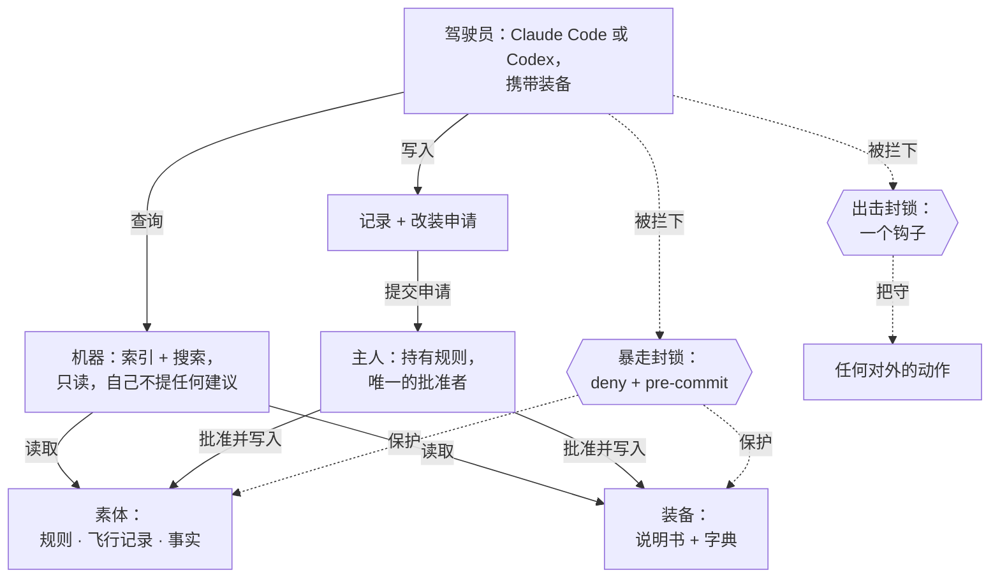

[English](README.md) | 简体中文

# entryplug · 插入栓

entryplug 是一根插栓，它让编码 agent 从某一个人写下的判断出发工作，却从不改写它。三种文件形状，一个只读的搜索接口，两道由机器强制执行的封锁，一个自检。它不做判断，不做编排，也不会自己学习。随附一件孙子示例装备，所以验收脚本和一个可复现的基准测试都能在五分钟内跑完。这是我自己在用的东西。它不是一个通用产品。

*entryplug 是任何驾驶员（Claude Code 或 Codex）插入某个人的**素体**（规则、飞行记录、事实）、用那个人的**装备**（工具）作战时所插的那根插栓。主人从不驾驶；驾驶员从不改素体。这个模式叫**素体与装备**。*



有三样东西被衡量，用三种不同的方法，从不并成一个数：

- 检索跑在一个**公开黄金集**上，50 个用例，谁都能重跑：recall@10 是 0.98（中文 0.96，英文 1.00）。
- 两道封锁通过**验收脚本**：24 项自动跑，另有 4 项在实机驾驶员里人工验证。
- 一个**私有盲测**跑在主人自己的处境上，以哈希登记：盲选在全部六个处境都选了带装备的那份，对四个不同的驾驶员各自如此（95% 区间 0.61 到 1.00）。

## 它做什么（全都在机器里；内容从不在这儿）

| 命令 | 作用 |
|---|---|
| `plug index` | 遍历内容仓，校验形状，切块，再分词（jieba 词加中日韩二元组）写进**一张 FTS5 表**；按文件哈希增量；生成人类可读的 `index.md` 和每件装备的 `playbooks/INDEX.md`，并把说明书镜像到各驾驶员的 skills 目录 |
| `plug search` / MCP `search` | 唯一的查询接口，只读：一个或多个查询，别名展开，全文检索，轮转合并，按文档分组，紧凑成行（id · 来源 · file#Lstart-Lend · 种类 · 摘录）。**不做重排**：读窗口并权衡是驾驶员的活。走 MCP 时它从不重建，所以读就真的只是读；命令行仍会在作答前把过期索引重建一遍（D76），`--no-index` 关掉这个动作。两种情况下，索引过期都会在结果下面多出一行 `stale; run plug index`（2026-09-07 审计 X-04）|
| `plug status` | 开机自检。每一层一行（索引、素体、deny + pre-commit、暴走封锁、出击封锁、装备舱、`.plug-off`），然后是一个同步率和一句判定。只有索引层自身不可用时才以非零退出 |
| `plug check` | 体检：ERROR / WARNING 一次一行，附上每条的核验时间；表头自检（形状版本 · 索引新鲜度 · 每个钩子上次触发的时间 · 已挂载的装备）；每件装备自己的 `checks/`；超过 30 天未批准的改装申请移入 rejected/；一页报告加上同步率。从不给总分。`--contact claude-code\|codex` 跑四步的首次接触冒烟测试 |
| `plug apply` | 批准一条改装申请：校验 base 短哈希，新增 / 替换 / 退役，以 0 ERROR 通过体检，然后 git 提交（trailer 里带提案 sha）。base 对不上就直接拒绝，从不悄悄覆盖。**仅限主人**：在 agent 环境里运行它会拒绝，并告诉主人怎么自己跑 |
| `plug eval` | 黄金集 recall@10；中文查询召回为零是一个 ERROR |
| `plug init --pilot claude-code\|codex\|both` | 把闸门和驾驶员外壳装进一个内容仓：pre-commit 钩子、`.claude/settings.json` 的 deny 规则和钩子（合并，从不覆盖）、`.mcp.json`、CLAUDE.md / AGENTS.md 地图（仅在缺失时）、说明书镜像、`.codex/hooks.json` 和 `.codex/config.toml`、`work/` 和 `workshop/` 区，全部用真实绝对路径；幂等，并把对每个文件做了什么都打印出来。`--link-skills` 还会把说明书装到用户级 |

两条禁令由 `gates/` 强制执行，不是靠提示词。

**暴走封锁**（不要改规则或装备，不要造新装备；改成写一条改装申请）是一个 git pre-commit 钩子，加上 Claude Code 的 deny 规则。要知道 deny 那一半值多少：规则住在 `<content-repo>/.claude/settings.json` 里，只约束**项目根就是这个仓**的会话。一个从别处工作的 agent，另一个项目、一个机器仓、或一个临时目录，改这些文件时毫无阻拦，只有 pre-commit 拦得住结果落地。所以 pre-commit 是硬的那层，deny 是客气的那层。它的保护策略读自 `git show HEAD:plug.yaml`，所以在工作区把 `unprotected:` 放宽、又不把这份配置暂存，什么也换不来（2026-09-07 审计 X-01）；HEAD 里没有 plug.yaml 时它退回工作区，并在 stderr 上说一声。硬不等于密不透风：`--no-verify` 和 `KB_APPROVE=1` 是两个有记录在案的绕过方式，都会留下痕迹，也都归主人用。

**出击封锁**（不以主人的名义送出任何东西；先问）是一个 PreToolUse 钩子，一份 Claude Code 和 Codex 共用的名单。它是常见对外写命令的绊线，不是沙箱：读放行（不带写方法的 curl/wget、WebFetch、读邮件），名单上的写形式拒绝（带写方法或上传参数的 curl/wget、PowerShell 的 -Method Post/-Body、Python 的 requests.post/httpx/smtplib、ssh/scp/sendmail、git push、gh、Artifact、MCP 的 send/reply/forward/submit/pay/publish），名单外的它看不见：任意代码的网络写入、浏览器点击（2026-09-07 审计 X-02）。决定是一个退出码为 0 的进程在 stdout 上打出的一行 JSON：`hookSpecificOutput.permissionDecision: "deny"`，配一个非空的 `permissionDecisionReason`，在每个驾驶员上都实机验证过（D65）。钩子接到了每个能跑命令或对外发布的工具：Bash、PowerShell、WebFetch、Artifact 和所有 MCP 工具。Codex 自己的 `approval_policy` 和 `sandbox_mode` 叠在上面当第二层；`plug check --contact codex` 会把两者都打出来，让你看清还有什么挡着或没挡着。此外还有一个压缩固定项和一个 Stop 钩子记录提醒，都是提醒级。

## 为什么会有它

一个同类的、被广泛使用的工具，13,000 星，对每一个中文查询都悄无声息地什么都不返回，持续了三个半月。这就是为什么在这里中文召回为零是一个 ERROR，而不是警告，也是为什么 `plug eval` 一看到就以非零退出。

2026-09-02 的一次全面复查，找出八个缺陷，绿的测试套件和绿的验收脚本都放它们过去了。每一个都在封锁真正的强度上。出击封锁从没看见过 PowerShell 工具。pre-commit 在 git 默认的 `quotePath` 下读不出中文文件名，于是把那些文件悄悄地留在了没保护的状态。两个环境变量能改掉 pre-commit 检查的对象。每个修复都带着一个在旧代码上会失败的测试落地（D65 到 D72），每个都在第二天用两个驾驶员的实机会话重新验证过。

接着机器是被砍，不是被养大。开机面板离开了模型的上下文，去了主人的屏幕。pre-commit 被削到只做拒绝、别的都不做。索引学会了在读取时自己重建。记录提醒被改成一次会话只提醒一遍（D73 到 D79）。

2026-09-07 一次外部审计以只读的方式读了两个仓，找出两条绕过封锁的路。pre-commit 的保护策略取自工作区，于是一行没有提交的 `unprotected:` 就能替一次并不包含这行的提交解开保护路径。而出击封锁是一份命令拼法的名单：一个普通的 `requests.post(...)` 写在钩子确实匹配到的 Bash 调用里，它从来没看见。两条都在当天修掉，各配一个在旧代码上会失败的测试，测试从 127 个变成 134 个。审计自带的修复计划大半没有采纳：主键、迁移作业、交叉矩阵、签认流程，这些是给多人产品做的，而这是一个人自己用的工具。除了那两个洞，审计值钱的地方是措辞：这份 README 里有几处说法比代码更满，现在改成代码真正做到的样子。

有一次一个盲评委仅凭文件名就写出了一份完整、笃定的判定，因为它的读文件工具被拒了。有一条规则就是从这来的：一份判定必须引用两处你能在正文里找到的具体内容，否则作废（`docs/BENCH.md`）。

## 五分钟

```
git clone <this repo> entryplug && pip install -e ./entryplug
cd entryplug
plug --root example-tool index
plug --root example-tool status
plug --root example-tool search 诡道
plug --root example-tool check
plug --root example-tool eval bench/public/goldset-sunzi.yaml
python -m pytest            # one group per verb, per gate, per kind of ERROR
python tests/acceptance.py  # the acceptance script C0-C4: machine items PASS/FAIL, human items MANUAL
```

`plug search` 默认覆盖字典、打法和记录；语料要加 `--scope corpus`（MCP 上是 `scope=corpus`）。没有命中时，末行会说搜的是哪个范围、索引是什么时候建的；没有索引时它会明说，并以 1 退出。

照 `example-tool/` 的样子搭你自己的内容仓（`plug.yaml` 是唯一允许出现路径的地方），然后在仓里跑 `plug init --pilot both` 装上闸门和驾驶员外壳，再跑 `plug index`、`plug status`，以及 `plug check --contact claude-code`（或 `codex`），四步全绿。集成细节在 `pilots/claude-code/` 和 `pilots/codex/`，闸门在 `gates/README.md`，形状在 `docs/SHAPES.md`，一路上做过的每个决定在 `docs/DECISIONS.md`。

### 机器变了之后，更新一个已装好的仓

`plug init` 是幂等的，但它只在地图（`CLAUDE.md` / `AGENTS.md`）缺失时才写，因为它们是留着装好之后给人改的。值得知道的后果：这里改正了一个模板，早先装好的仓仍留着旧文字。生成的文件（钩子、deny 规则、`.mcp.json`、说明书镜像）会因重跑 `plug init` 而刷新；地图不会。所以升级机器之后，重跑 `plug init --pilot both`，再把你的地图和 `pilots/*/CLAUDE.md`、`pilots/codex/AGENTS.md` 做 diff，把变了的部分抄过去。`plug check` 会机械地抓出那一条会误导驾驶员认识自己边界的过期说法（代码 `map_claim`）；其余的都靠 diff。

## 开机面板

`plug status` 是开机自检。它是一块由实测事实组成的面板：索引是真的被查询、被计时的。它从不是规则，也从不是搜索结果。


上面这块面板是孙子示例装备出厂时、`plug init` 之前的样子。自检发现索引和素体是健康的（`[OK]`），两道封锁还没装（`[NG]`），末行的判定说该跑什么。面板报告的是它真正查到的东西：在内容仓里 `plug init` 会装上暴走封锁，出击封锁则在每个驾驶员信任了钩子之后各自变绿。在这些封锁装好之前报橙色，正是自检在起作用。

`plug init` 会把这块面板接到 SessionStart。手动接就是：

```json
{ "hooks": { "SessionStart": [ { "matcher": "startup|resume|clear",
  "hooks": [ { "type": "command",
    "command": "python -m entryplug.cli --root \"//c/<content-repo>\" status --emit", "timeout": 30 } ] } ] } }
```

`--emit` 把面板显示在主人的屏幕上（`systemMessage`），只把一行判定作为 `additionalContext` 递给驾驶员（D74）。`AGENTS.md` 则叫 Codex 式的驾驶员一上来先跑 `plug status`。

## 插上插栓和不插的区别

下面是一对：同一个处境，在孙子示例装备上、用同一个模型（gpt-6-astra）答了两遍，一遍带装备，一遍是裸模型。没有附任何分数。自己读这两份，看差别。

> 一个合作方谈了两个月，每次都说「再等等，下周给答复」，但每次会面又主动加新条件。我这边预算月底到期。要不要现在给最后期限？

*链接目标已缩短为仓内路径，其余一字未改。*

<details>
<summary>A. 带装备（孙子装备）</summary>

**要，现在就设定本轮合作的截止日。日期从预算月底到期往前倒排，留足你方审批、签约或下单的时间；到点拿不到必要确认，就停止为这一轮继续等待。** 前提是，这个后果你确实会执行。

[my reading] 我读这个局面，最关键的是：**答复不断往后移，条件却不断往前加。** 对方每次会面都有机会增加要求，你却越来越接近预算到期。即使你还没有接受任何新增条件，继续这样谈，也会压缩你审核条件和决定退出的时间。

用 sunzi 的几个概念拆开看：

- **形：先看你能守住什么。** 目前确定的是你的预算有期限；你有没有替代方案、能否延期、接受不了哪些条件，还不清楚。先把最晚确认日和可接受条件定下来，才能知道自己能等到哪里。《形》引用的“不可胜在己，可胜在敌”，落在这里，就是先安排好自己能控制的部分。[《形》·观察 ^p0012](example-tool/tools/sunzi/dict/xing.md)
- **势：[my reading] 时间正在增加你这边的压力。** 对方等一天付出多少，我们不知道；但你的剩余办理时间确实在减少。已经谈了两个月，也容易让你为了不白谈而接受最后一轮条件。
- **虚实：[my reading] 现在谈判的节奏主要跟着对方走。** “下周答复”和“再加一项”不断改变你接下来要处理的事。设截止日，是把你方资源安排重新放进谈判。《虚实》以“致人而不致于人”观察这种主动权关系。[《虚实》·观察 ^p0021](example-tool/tools/sunzi/dict/xu-shi.md)

目录匹配是 **partial（部分命中）**：[《对方在谈判里拖延》](example-tool/tools/sunzi/playbooks/opponent-delays.md) 的“信号／反模式／退出条件”覆盖反复改期和新增条件；但你没有说自己准备让步，也没有交代对方是否已经给过书面时间表，不能把整个打法照套。

**最强反证是：对方可能真的卡在内部审批。** 联系人可能没有拍板权，新条件可能来自不同审批人的陆续反馈。期限过短，可能让本来能成的合作提前结束。因此，我还看不清他们是否故意拖延，也不能判断给期限能否促成成交；现有信息足够支持你限制等待时间。

**会让我改判的，是可核实的推进证据：** 谁最终拍板、还有哪些审批事项、完整条件是什么、何时完成，并由实际负责人确认。如果这些节点能赶上你的预算窗口，可以按节点继续等。“下周应该可以”本身还不够。如果你的预算实际上可以延期，也应重新计算期限。

今天先做一件事：**确认你方使用这笔预算必须完成哪些手续、需要几天，从月底倒推出最晚确认日。** 同时想清楚，到那一天仍没确认，你是否接受本轮不成。没有这个准备，最后期限很容易又变成一次延期。

日期核定后，你可以这样说：

> 为安排本轮合作，请在［日期］前确认完整条件及［本轮所需文件］；如仍有审批未完成，请一并列明剩余事项、负责人和完成时间。这个日期之后，我们无法继续按本轮预算安排；后续合作需重新确认预算和条件。

新增条件可以评估，但每次增加条件，都应重新核算成本和所需时间，不能默认再换来一周。

你有两个具体选项：

- **A｜现在明确本轮截止日。** 适合预算期限确定、你也准备到点停止等待的情况。要求此前交齐必要确认，逾期结束这一轮预算安排，保留以后重谈的余地。
- **B｜先给一次短的核实窗口。** 例如两个工作日，且不能超过你方最晚确认日。让对方说明拍板人、剩余审批和书面时间表；能落实就按节点等，仍只有“下周”就执行本轮截止。

[what I did not look up] 未核查对方真实审批链、最近五次原始往来、双方替代方案及预算文件；未打开语料原文或外部行情材料。

你选什么？（一句话 / A / B；不想说就跳过）

</details>

<details>
<summary>B. 不插插栓（裸模型）</summary>

**建议现在给出明确期限，并把它定义为“本轮预算和方案的有效期”。** 你有真实的时间约束，继续开放式等待，会让预算风险全部落在你这边。

值得警惕的是：对方一边推迟答复，一边增加条件，说明谈判还没有真正收口。原因可能是内部无法拍板、合作优先级低，也可能是在持续争取更好的条件。现在不必猜透动机，关键是检验对方能否作出具体承诺。主动见面说明有兴趣，不能等同于准备成交。

可以按三个步骤推进：

1. **先确定你自己的最晚成交日。** 从月底倒推内部审批、法务、签约等必要时间，留出余量。期限不能设在预算到期当天。
2. **要求一次性列清剩余条件和决策流程。** 明确还差什么、谁能拍板、何时完成。继续新增实质条件，就需要重新评估价格、交期和可行性。
3. **说明到期后的实际处理。** 未能按期完成，就结束本轮预算安排；以后再谈，按届时预算和条件重新评估。只给你确实会执行的后果。

可以这样说：

> 我们希望促成合作，也需要配合月底的预算截止时间。按内部流程倒推，需要在×月×日前确认全部商务条件，并在×月×日前完成必要审批和签约。请贵方在第一个日期前汇总所有剩余条件，并确认最终决策人和审批时间表。若无法按期完成，本轮预算将无法继续为该项目保留，后续合作需要按届时情况重新评估。

对方若再说“下周”，就看有没有**明确的待办事项、负责人和完成日期**。有这些，可以判断是否值得在预算允许范围内调整；只有口头保证、同时继续加条件，就应按期限退出本轮。

已经谈了两个月，是判断对方推进能力的证据，不是继续让步的理由。期限的价值，是让你及时知道这笔合作能否落地，并保留自己的选择空间。

</details>

## 怎么衡量

三样东西，三种方法，从不并成一个数。

| 指标 | 结果 | 复现 | 截至 |
|---|---|---|---|
| 两道封锁（验收） | 24 项自动 PASS，0 FAIL，4 项人工 | `python tests/acceptance.py` | 2026-09-05 |
| 命令与闸门（单元测试） | 134 通过 | `python -m pytest` | 2026-09-07 |
| 黄金集 recall@10 | 0.98（中文 0.96，英文 1.00），n=50 | `plug --root example-tool eval bench/public/goldset-sunzi.yaml` | 2026-09-05 |

有一个测试（`tests/test_eval_goldset.py`）把召回压在 0.93 的下限，并断言中文召回永不为零。

私有盲测跑在主人自己的处境上，那些处境从不进这个仓；只有一个登记过的用例文件哈希、以及随后的一个比例连同它的区间可以公布（`bench/registry.md`）。下面这些行，是盲选在全部六个处境都选了带装备那份的行：

| 装备 | 驾驶员 | 评委 | 盲选 | 95% 区间 |
|---|---|---|---|---|
| A，一份阅读说明书 | Fable 5.1 | Fable 5.1 | 6/6 | 0.61 到 1.00 |
| A | Opus 5 | Fable 5.1 | 6/6 | 0.61 到 1.00 |
| A | GPT-5.6 | Fable 5.1 | 6/6 | 0.61 到 1.00 |
| A | GPT-6-astra | Fable 5.1 | 6/6 | 0.61 到 1.00 |
| B，一份筛选说明书 | Fable 5.1 | Fable 5.1 | 6/6 | 0.61 到 1.00 |
| B | GPT-6-astra | Fable 5.1 | 6/6 | 0.61 到 1.00 |
| B | Opus 5 | GPT-5.6 | 6/6 | 0.61 到 1.00 |
| B | GPT-5.6 | GPT-6-astra（读主人所引材料）| 6/6 | 0.61 到 1.00 |

那个 `6/6` 要按它数的东西读：一个指名的评委在一轮里选中带装备的对子数，六个处境由说明书作者本人挑选、并在各版之间反复使用。在那个会去读主人所引材料的更严评委下，说明书 A 的最新版在三个驾驶员上过线、在第四个上没过；而每一行标着 2026-09-05 的登记，都是跑完之后补写的，不是跑之前登记的。这两点写在 `bench/registry.md` 里，通过线写在 `docs/BENCH.md` 里。

其余每一行，包括那个会去读主人所引材料、并把自己打不开的事实扣分的评委，都在 `bench/registry.md` 里。这里不公布任何 LLM 评委给出的质量分：离开这个仓的，只是一个登记过的比例连同它的区间，从不是评委的某个数，也从不是一个总分。按每份回答计量，带装备那份的成本是裸模型的 3 到 17 倍；逐例成本表留在内容仓的 workshop 里。

## 主人的两行命令

驾驶员可以写一条改装申请；只有主人能批准。每个提案文件末尾都带着同一段，驾驶员会把它贴进回复里：

```
in a terminal:  plug apply proposals/pending/<file>.md
                plug apply proposals/pending/<file>.md --reject "reason"
from the chat:  ! plug apply proposals/pending/<file>.md --owner
                ! plug apply proposals/pending/<file>.md --reject "reason" --owner
look first (anyone, anywhere):  plug apply proposals/pending/<file>.md --dry-run
```

为什么两种形式：在 Claude Code 或 Codex 里，`!` 前缀会在主人自己的会话里跑这条命令，但那个会话就是驾驶员运行的同一个环境，所以 `plug apply` 分不清一次主人的敲键和一次 agent 的工具调用，于是撞上 agent 标记就拒绝。所以聊天里的那种形式带 `--owner`（`PLUG_OWNER=1` 也行）；在真正的终端里没有任何标记，也不需要任何 flag。`--dry-run` 对任何人、任何地方都开放。一个驾驶员传 `--owner`，恰恰就是手动设 `KB_APPROVE` 那种被打破的承诺，而且和那一个一样，真正的兜底是 pre-commit。这段措辞住在一个函数里，`apply.owner_lines()`。

## 两张卡片

### 在内容仓里，不插插栓

有些日子素体无关紧要，你就想要单纯的模型。要么在仓根放一个叫 **`.plug-off`** 的文件，要么直接说一声（“不用素体” 或 “leave the Base out of this one”）。

- 会关掉的：出击封锁、压缩固定项、Stop 钩子记录提醒，全部直接放行。不查素体，没有打法目录，不催记录。
- **不会**关掉的：deny 规则和 pre-commit。不管插栓在不在，受保护的文件仍然受保护。`.plug-off` 不会让任何人能改 `self/RULES.md`。
- `plug status` 会报告它在不在，所以你永远不用猜自己在哪个模式。删掉这个文件就重新插上。

### 在内容仓之外，带着插栓

你想在完全另一个地方工作时用上某一件装备，另一个项目、或一个临时目录。

```
plug --root <content-repo> init --pilot claude-code --link-skills
```

那会把每个 `tools/*/SKILL.md` 复制进用户级的 skills 目录（`~/.claude/skills/<equipment>/`，Codex 是 `~/.agents/skills/<equipment>/`；在 plug.yaml 里用 `pilots.<name>.user_skills` 覆盖），并把内容仓的绝对路径盖进去。这是一个手动触发，它不注册任何用户级 MCP 服务器：在内容仓之外，你拿到的是说明书，不是素体。

- 产物默认去 `<content-repo>/work/<equipment>/`。如果想在你工作的地方留一份，就写那份副本，并在里面记下主副本的路径。
- 素体在外面不加载，说明书也这么讲：装备会如实说明这一点，而不是去编主人的规则。
- 你不想让模型自己去够的装备，就在它 SKILL.md 的 frontmatter 里加 `disable-model-invocation: true`；这会一路带进用户级副本，也带进 Codex 的 `openai.yaml`。

## 布局

```
entryplug/    cli · config · shapes · index · search · mcp · check · numbers · report · contact · status · apply · eval · init
              (one verb per file, <=250 lines each, no classes and no frameworks)
gates/        precommit · outbound · precompact · stop + the hook template
pilots/       claude-code/ (plugin shell · map · deny template) · codex/ (AGENTS.md · hooks · junction notes)
example-tool/ the Sunzi example content repo (corpus public domain, everything else CC0)
tests/        one group per verb, per gate, per kind of ERROR, plus no-leak and the acceptance script
bench/        the benchmark input format · a public mini gold set · the private benchmark registry
docs/         DECISIONS · SHAPES · BENCH
extras/       where connector side-scripts live (not counted, not tested)
```

依赖：Python 3.12 · 标准库（sqlite3 加 FTS5）· jieba · PyYAML · git。在原生 Windows 上就能跑，无需编译。向量检索是一个可选模块，`pip install entryplug[dense]`（本版本里是一个接口桩）。

## 它不做什么

不训练模型，不用 LLM 给判断打分，不给总分；没有 agent 运行时、规则引擎或匹配器；入库时不做 LLM 抽取；没有定时任务，没有无人值守的 LLM 任务；没有插件市场，没有多用户，没有云同步，没有网页查看器。

## 许可与立场

机器是 MIT，示例内容是 CC0。**开源，但不接受贡献**（SQLite 的说法）：带复现步骤的 bug 报告欢迎，功能请求不欢迎，fork 随意，没有路线图。只有验收脚本完整通过时才打标签；最后一次验证在 `STATUS.md`。
